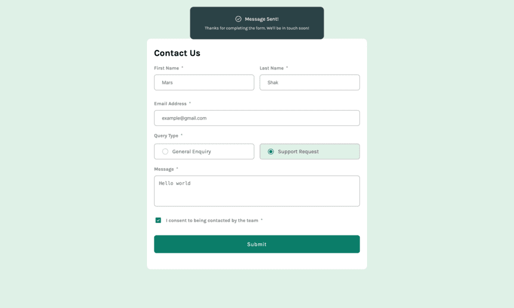
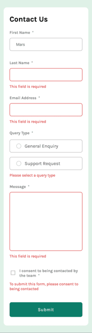

# Frontend Mentor - Contact form solution

This is a solution to the [Contact form challenge on Frontend Mentor](https://www.frontendmentor.io/challenges/contact-form--G-hYlqKJj). Frontend Mentor challenges help you improve your coding skills by building realistic projects.

## Table of contents

- [Overview](#overview)
  - [The challenge](#the-challenge)
  - [Screenshot](#screenshot)
  - [Links](#links)
- [My process](#my-process)
  - [Built with](#built-with)
  - [What I learned](#what-i-learned)
  - [Continued development](#continued-development)
- [Author](#author)

## Overview

### The challenge

Users should be able to:

- Complete the form and see a success toast message upon successful submission
- Receive form validation messages if:
  - A required field has been missed
  - The email address is not formatted correctly
- Complete the form only using their keyboard
- Have inputs, error messages, and the success message announced on their screen reader
- View the optimal layout for the interface depending on their device's screen size
- See hover and focus states for all interactive elements on the page

### Screenshot

### Links

- Solution URL: [GitHub](https://github.com/JetMars/fmentor-contact-form)
- Live Site URL: [Versel](https://fmentor-contact-form.vercel.app)

### Built with

- Mobile-first workflow
- [React](https://reactjs.org/) - JS library
- [Next.js](https://nextjs.org/) - React framework
- [TypeScript](https://www.typescriptlang.org) - TypeScript is JavaScript with syntax for types.
- [Zod.dev](https://zod.dev) - TypeScript-first schema validation with static type inference
- [clsx](https://www.npmjs.com/package/clsx) - A tiny utility for constructing className strings conditionally.

### What I learned

I understood how 'useFormState' and actions works.

### Continued development

i'll want to learn more different react hooks and use them in my projects.

## Author

- Frontend Mentor - [@JetMars](https://www.frontendmentor.io/profile/JetMars)
- GitHub - [Github](https://github.com/JetMars)
